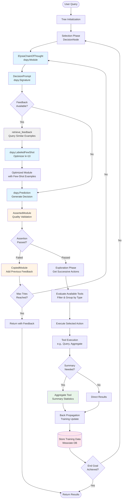

# Elysia MCTS Implementation Study

This document provides a comprehensive analysis of Elysia's Monte Carlo Tree Search (MCTS)-like implementation, exposing the functional modules that control the underlying reasoning mechanisms.

## Overview

Elysia implements an MCTS-inspired decision tree system where agents navigate through a tree of possible actions to solve complex user queries. Unlike traditional MCTS which uses random simulation, Elysia uses structured LLM-based reasoning at each decision point, combined with sophisticated feedback mechanisms for continuous improvement.

## MCTS Architecture Diagram

The following diagram illustrates Elysia's MCTS implementation with integrated DSPy components and feedback mechanisms:



### Diagram Components

#### DSPy Framework Components (Blue)
- **[`dspy.Module`](https://dspy.ai/api/modules/)**: Base class for all reasoning modules (ElysiaChainOfThought)
- **[`dspy.Signature`](https://dspy.ai/api/signatures/)**: Defines input/output structure (DecisionPrompt)
- **[`dspy.LabeledFewShot`](https://dspy.ai/api/optimizers/LabeledFewShot/)**: Optimizer that compiles modules with labeled examples
- **[`dspy.Prediction`](https://dspy.ai/api/primitives/prediction/)**: Structured LLM output predictions

#### Feedback & Quality Mechanisms (Orange)
- **AssertedModule**: Validates decisions with custom assertion functions, implements retry logic
- **CopiedModule**: Integrates historical feedback from failed attempts into prompts

#### Filtering & Retrieval (Gray)
- **retrieve_feedback**: Queries Weaviate database for similar past examples using vector similarity (threshold: 0.7)
- Filters examples by relevance and retrieves top-k (n=10) for few-shot learning

#### Summary & Aggregation (Green)
- **Aggregate Tool**: Provides summary statistics (count, sum, average) on data collections
- Applies filters and grouping for data summarization

#### Training & Storage (Pink)
- **TrainingUpdate**: Stores decision outcomes and tool results
- **Weaviate DB**: Persistent storage for feedback examples and training data


## Core MCTS Components

### 1. Selection/Choice Mechanism

**Primary Module**: `elysia.tree.util.DecisionNode`
**Full Path**: [`/elysia/tree/util.py`](https://github.com/supmo668/elysia/blob/main/elysia/tree/util.py#L218-L502) (lines 218-502)

The DecisionNode class implements the selection phase of MCTS, choosing the most promising action from available options.

**Key Components**:
- **Decision Making**: Uses DSPy-based `ElysiaChainOfThought` with `DecisionPrompt` signature
- **Prompt Template**: `elysia.tree.prompt_templates.DecisionPrompt` ([`/elysia/tree/prompt_templates.py`](https://github.com/supmo668/elysia/blob/main/elysia/tree/prompt_templates.py#L5-L130) lines 5-130)
- **Choice Logic**: `__call__` method evaluates available tools and makes decisions

```python
# Core decision-making process
decision_module = ElysiaChainOfThought(
    DecisionPrompt,
    tree_data=tree_data,
    environment=True,
    collection_schemas=self.use_elysia_collections,
    tasks_completed=True,
    message_update=True,
    reasoning=tree_data.settings.BASE_USE_REASONING,
)

decision_executor = AssertedModule(
    decision_module,
    assertion=self._tool_assertion,
    max_tries=2,
)
```

**DSPy Module**: `ElysiaChainOfThought` extends `dspy.Module`
**Full Path**: [`/elysia/util/elysia_chain_of_thought.py`](https://github.com/supmo668/elysia/blob/main/elysia/util/elysia_chain_of_thought.py#L24-L421) (lines 24-421)

### 2. Exploration Factor

**Primary Module**: `elysia.tree.tree.Tree._get_successive_actions()`
**Full Path**: [`/elysia/tree/tree.py`](https://github.com/supmo668/elysia/blob/main/elysia/tree/tree.py) (method within Tree class)

The exploration mechanism evaluates future possible actions to inform current decisions.

**Key Components**:
- **Successive Actions**: Maps current actions to their potential follow-up actions
- **Available Tools Evaluation**: `_get_available_tools()` method determines which actions are currently possible
- **Tool Availability Rules**: Each tool can implement `is_tool_available()` and `run_if_true()` methods

```python
# Exploration through successive actions
successive_actions = self._get_successive_actions(
    successive_actions={},
    current_options=init_options,
)

# Decision considers future possibilities
available_actions: list[dict] = dspy.InputField(
    description="List of possible actions to choose from for this task only"
)
successive_actions: str = dspy.InputField(
    description="Actions that stem from actions you can choose from"
)
```

### 3. Evaluation Mechanism

**Primary Module**: `elysia.tree.util.AssertedModule`
**Full Path**: [`/elysia/tree/util.py`](https://github.com/supmo668/elysia/blob/main/elysia/tree/util.py#L153-L215) (lines 153-215)

The evaluation phase ensures decisions meet quality criteria through assertion-based feedback loops.

**Key Components**:
- **Assertion Function**: Custom validation logic for each decision
- **Retry Mechanism**: Automatic retry with feedback when assertions fail
- **Feedback Integration**: Previous failures inform subsequent attempts

```python
class AssertedModule(dspy.Module):
    """
    A module that calls another module until it passes an assertion function.
    This function returns a tuple of (asserted, feedback).
    If the assertion is false, the module is called again with the previous feedbacks and attempts.
    """
    
    def __init__(
        self,
        module: ElysiaChainOfThought,
        assertion: Callable[[dict, dspy.Prediction], tuple[bool, str]],
        max_tries: int = 3,
    ):
        self.assertion = assertion
        self.module = module
        self.max_tries = max_tries
        self.previous_feedbacks = []
        self.previous_attempts = []
```

**DSPy Integration**: Uses `dspy.Module` base class with custom assertion logic

### 4. Back Propagation/Feedback Mechanism

**Primary Module**: `elysia.tree.util.CopiedModule`
**Full Path**: [`/elysia/tree/util.py`](https://github.com/supmo668/elysia/blob/main/elysia/tree/util.py#L77-L152) (lines 77-152)

The back propagation mechanism updates the system based on previous decisions and their outcomes.

**Key Components**:

#### A. Training Updates
**Module**: `elysia.util.objects.TrainingUpdate`
**Purpose**: Stores decision outcomes for learning

```python
results = [
    TrainingUpdate(
        module_name="decision",
        inputs=tree_data.to_json(),
        outputs={k: v for k, v in output.__dict__["_store"].items()},
    ),
    Status(str(self.options[output.function_name]["status"])),
]
```

#### B. Feedback Retrieval
**Module**: `elysia.util.retrieve_feedback.retrieve_feedback`
**Full Path**: [`/elysia/util/retrieve_feedback.py`](https://github.com/supmo668/elysia/blob/main/elysia/util/retrieve_feedback.py#L8-L92) (lines 8-92)

Retrieves similar examples from the feedback database for few-shot learning:

```python
async def retrieve_feedback(
    client_manager: ClientManager, 
    user_prompt: str, 
    model: str, 
    n: int = 6
) -> tuple[list[dspy.Example], list[str]]:
    """
    Retrieve similar examples from the database.
    """
```

#### C. Contextual Feedback Integration
**Module**: `elysia.tree.util.CopiedModule`

Integrates previous failed attempts into new decision attempts:

```python
class CopiedModule(dspy.Module):
    """
    A module that copies another module and adds a previous_feedbacks field to the signature.
    This is used to store the previous errored decision attempts for the decision node.
    """
    
    def __init__(self, module: ElysiaChainOfThought, **kwargs):
        feedback_desc = (
            "Pairs of INCORRECT previous attempts at this action, and the feedback received for each attempt. "
            "Judge what was incorrect in the previous attempts. "
            "Follow the feedback to improve your next attempt."
        )
```

#### D. Few-Shot Learning with DSPy
**Module**: `elysia.util.elysia_chain_of_thought.ElysiaChainOfThought.aforward_with_feedback_examples`
**Full Path**: [`/elysia/util/elysia_chain_of_thought.py`](https://github.com/supmo668/elysia/blob/main/elysia/util/elysia_chain_of_thought.py#L345-L421) (lines 345-421)

```python
async def aforward_with_feedback_examples(
    self,
    feedback_model: str,
    client_manager: ClientManager,
    base_lm: dspy.LM,
    complex_lm: dspy.LM,
    num_base_lm_examples: int = 3,
    return_example_uuids: bool = False,
    **kwargs,
) -> tuple[dspy.Prediction, list[str]] | dspy.Prediction:
    """
    Use the forward pass of the module with feedback examples.
    This will first retrieve examples from the feedback collection, 
    and use those as few-shot examples to run the module.
    """
    
    examples, uuids = await retrieve_feedback(
        client_manager, self.tree_data.user_prompt, feedback_model, n=10
    )
    
    if len(examples) > 0:
        optimizer = dspy.LabeledFewShot(k=10)
        optimized_module = optimizer.compile(self, trainset=examples)
```

## MCTS Process Flow

### 1. Tree Initialization
**Location**: `elysia.tree.tree.Tree.__init__`
- Initializes decision nodes and tree structure
- Sets up environment and tree data
- Configures DSPy language models

### 2. Main Execution Loop
**Location**: `elysia.tree.tree.Tree.async_run` ([`/elysia/tree/tree.py`](https://github.com/supmo668/elysia/blob/main/elysia/tree/tree.py#L1431-L1550) lines 1431-1550)

```python
while True:
    # Selection: Get available tools
    available_tools, unavailable_tools = await self._get_available_tools(
        current_decision_node, client_manager
    )
    
    # Exploration: Get successive actions
    successive_actions = self._get_successive_actions(
        successive_actions={},
        current_options=init_options,
    )
    
    # Decision: Make choice using MCTS-like reasoning
    decision, results = await current_decision_node(
        tree_data=self.tree_data,
        base_lm=self.base_lm,
        complex_lm=self.complex_lm,
        available_tools=available_tools,
        unavailable_tools=unavailable_tools,
        successive_actions=successive_actions,
        client_manager=client_manager,
    )
    
    # Evaluation & Back Propagation: Store results for learning
    self.training_updates.extend(results)
```

### 3. Feedback Integration
**Location**: Throughout the decision process

- **Immediate Feedback**: AssertedModule provides immediate validation
- **Historical Feedback**: CopiedModule incorporates past failures
- **Database Feedback**: retrieve_feedback provides similar examples
- **Contextual Learning**: DSPy few-shot learning optimizes modules

## Control Parameters

### 1. Choice Control
- **max_tries**: Maximum retry attempts in AssertedModule (default: 3)
- **assertion function**: Custom validation logic for decisions
- **USE_REASONING**: Controls whether to include step-by-step reasoning

### 2. Exploration Control
- **recursion_limit**: Maximum tree depth (TreeData.recursion_limit)
- **tool availability rules**: Custom logic for when tools can be used
- **successive_actions depth**: How far ahead to look in action tree

### 3. Evaluation Control
- **feedback retrieval count**: Number of examples to retrieve (n parameter)
- **certainty threshold**: Weaviate similarity threshold (default: 0.7)
- **few-shot examples**: Number of examples for DSPy optimization (k=10)

### 4. Back Propagation Control
- **USE_FEEDBACK**: Global setting to enable/disable feedback system
- **feedback storage**: Weaviate database configuration
- **training update collection**: What information to store for learning

## DSPy Framework Integration

Elysia extensively uses the DSPy framework for structured LLM interactions:

### Core DSPy Components Used:

1. **dspy.Module**: Base class for all reasoning modules
2. **dspy.Signature**: Defines input/output structure for LLM calls
3. **dspy.LabeledFewShot**: Optimizer for few-shot learning
4. **dspy.InputField/OutputField**: Structured prompt fields
5. **dspy.Prediction**: Structured LLM outputs

### Key DSPy Modules in Elysia:

- **ElysiaChainOfThought**: Main reasoning module
- **DecisionPrompt**: Decision-making signature
- **AssertedModule**: Quality assurance wrapper
- **CopiedModule**: Feedback integration wrapper

## Usage Examples

### Basic Decision Making
```python
# Create decision node
decision_node = DecisionNode(
    id="root",
    options=available_tools,
    instruction="Choose the best tool for the task"
)

# Make decision with MCTS-like reasoning
decision, results = await decision_node(
    tree_data=tree_data,
    base_lm=base_lm,
    complex_lm=complex_lm,
    available_tools=tools,
    unavailable_tools=[],
    successive_actions=future_actions,
    client_manager=client_manager,
)
```

### Enabling Feedback Learning
```python
# Enable feedback in settings
tree_data.settings.USE_FEEDBACK = True

# Decision will automatically use historical examples
output, uuids = await decision_executor.aforward_with_feedback_examples(
    feedback_model="decision",
    client_manager=client_manager,
    base_lm=base_lm,
    complex_lm=complex_lm,
    **decision_inputs
)
```

### Custom Assertion Functions
```python
def custom_assertion(kwargs, pred):
    # Custom validation logic
    is_valid = pred.function_name in allowed_functions
    feedback = f"Must choose from: {allowed_functions}" if not is_valid else ""
    return is_valid, feedback

# Use with AssertedModule
decision_executor = AssertedModule(
    decision_module,
    assertion=custom_assertion,
    max_tries=5,
)
```

## Conclusion

Elysia's MCTS implementation provides a sophisticated framework for decision-making in complex reasoning tasks. The system combines the systematic exploration of MCTS with the contextual understanding of large language models, enhanced by continuous learning through feedback mechanisms.

The modular design allows for fine-grained control over each aspect of the reasoning process, from initial choice selection to final evaluation and learning. The extensive use of the DSPy framework ensures structured, optimizable interactions with language models throughout the process.